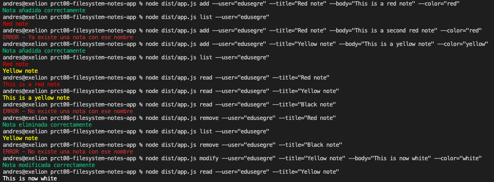
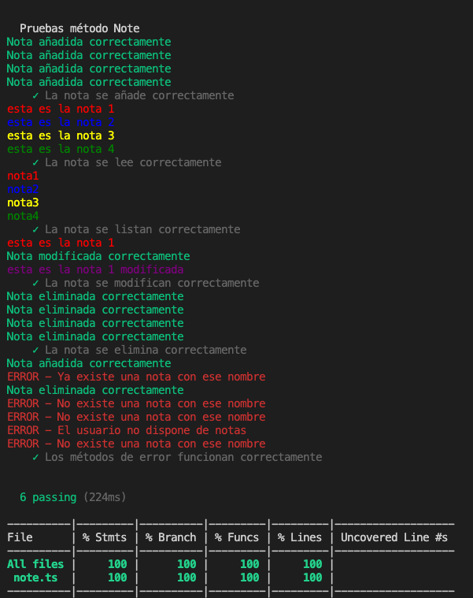

---
# Feel free to add content and custom Front Matter to this file.
# To modify the layout, see https://jekyllrb.com/docs/themes/#overriding-theme-defaults

layout: default
---

# DSI 2021: Práctica 8 - Aplicación de procesamiento de notas de texto  (filesystem-notes-app-andrescna)

## Introducción y objetivos

En esta práctica, tendrá que implementar una aplicación de procesamiento de notas de texto. En concreto, la misma permitirá añadir, modificar, eliminar, listar y leer notas de un usuario concreto. Las notas se almacenarán como ficheros JSON en el sistema de ficheros de la máquina que ejecute la aplicación. Además, solo se podrá interactuar con la aplicación desde la línea de comandos.

Este informe se ha desarrollado en base al contenido de la [guía de la práctica [1]](https://ull-esit-inf-dsi-2021.github.io/prct08-filesystem-notes-app/) en Github.

## Desarrollo

### Prerrequisitos: Familiarización con los paquetes a utilizar

Para está práctica es necesario instalar los paquetes [yargs [2]](https://www.npmjs.com/package/yargs), [chalk [3]](https://www.npmjs.com/package/chalk) y familiarizarse con la [API para trabajar de forma síncrona con ficheros de node.js [4]](https://nodejs.org/dist/latest-v15.x/docs/api/fs.html#fs_synchronous_api)

### Código

El código se ha distribuido en dos ficheros:

- `app.ts`: implementa la consola de comandos
- `note.ts`: implementa las operaciones con notas y la interacción con el sistema de archivos

Todas las operaciones en `app.ts` tienen la misma estructura:

```typescript
yargs.command({
    command: 'add',
    describe: 'Añade una nueva nota',
    builder: {
        user: {
            describe: 'Usuario',
            demandOption: true,
            type: 'string',
        },
        title: {
            describe: 'Título',
            demandOption: true,
            type: 'string',
        },
        body: {
            describe: 'Contenido de la nota',
            demandOption: true,
            type: 'string',
        },
        color: {
            describe: 'Color de la nota',
            demandOption: true,
            type: 'string',
        },
    },

    handler(argv) {
        if (typeof argv.user === 'string' && typeof argv.title === 'string' && typeof argv.body === 'string' && typeof argv.color === 'string') {
        const Nota: Note = new Note(argv.user);
        Nota.addNote(argv.title, argv.body, argv.color);
        }
    },
});
```

La función `yargs.command`recibe varios parámetros:

- `command`: El comando que define la operación a realizar
- `describe`: descripción de la operación
- `builder`: constructor de la función. Este a su vez recibe los argumentos que se solicitarán al usuario al invocar el programa

Además, también incluye una función `handler` que comprueba si los argumentos se han introducido correctamente y en ese caso invoca la función de la clase `Note` que ejecuta la operación correspondiente.

En el fichero `note.ts`se encuentra la definición de la clase `Note`. Se ha optado porque la clase incluya un único atributo, el nombre del usuario que la invoca. Además del constructor y un getter para el nombre de usuario (`getUser()`), contiene las siguientes funciones:

```typescript
class Note {

    addNote(title: string, body: string, color: string) {
        
        let path: string = 'user/' + this.user;
        
        if (fs.existsSync(path)) {
            if (fs.existsSync(path + "/" + title + '.json'))
                console.log(chalk.red("ERROR - Ya existe una nota con ese nombre"));
            else {
                let newNote = {"title": title, "body": body, "color": color};
                let newNoteJSON = JSON.stringify(newNote);
                fs.writeFileSync(path + "/" + title + '.json', newNoteJSON)
                console.log(chalk.green("Nota añadida correctamente"));
            }
        }
        else {
            fs.mkdirSync(path);
            let newNote = {"title": title, "body": body, "color": color};
            let newNoteJSON = JSON.stringify(newNote);
            fs.writeFileSync(path + "/" + title + '.json', newNoteJSON)
            console.log(chalk.green("Nota añadida correctamente"));
        }
    }
}
```

La función `addNote()` se encarga de añadir una nota. Primero comprueba si el usuario ya existe (es decir, que tenga un directorio asignado). Si existe el directorio, comprueba si la nota ya existe. Si no existe, la crea parseando los datos de la nota a un JSON y escribiendo el resultado en un fichero `title.json`. Si el usuario no existe, crea el directorio y la nota. En otro caso, da error.

```typescript
class Note {

    removeNote(title: string) {

        let path: string = 'user/' + this.user;
        
        if (fs.existsSync(path + "/" + title + '.json')) {
            fs.rmSync(path + "/" + title + '.json');
            console.log(chalk.green("Nota eliminada correctamente"));
        }
        else {
            console.log(chalk.red("ERROR - No existe una nota con ese nombre"));
        }
    }
```
La función `removeNote()` se encarga de eliminar una nota. Simplemente comprueba si la nota ya existe, y si existe elimina el archivo. En caso contrario, avisa del error.

```typescript
class Note {

    modifyNote(title: string, body: string, color: string) {

        let path: string = 'user/' + this.user;
        
        if (fs.existsSync(path + "/" + title + '.json')) {
            fs.rmSync(path + "/" + title + '.json');
            let modNote = {"title": title, "body": body, "color": color};
            let modNoteJSON = JSON.stringify(modNote);
            fs.writeFileSync(path + "/" + title + '.json', modNoteJSON)
            console.log(chalk.green("Nota modificada correctamente"));
        }
        else {
            console.log(chalk.red("ERROR - No existe una nota con ese nombre"));
        }
    }
```

La función `modifyNote()` se encarga de modificar una nota ya existente. Primero comprueba si la nota existe. Si no existe,da error. Si existe, la borra y crea una nueva nota manteniendo el título original pero con los nuevos atributos `body`y `color`.

```typescript
class Note {

    listNotes(){

        let path: string = 'user/' + this.user;
        
        if (fs.readdirSync(path).length === 0) {
            console.log(chalk.red("ERROR - El usuario no dispone de notas"));
        }
        else {
            let notes = fs.readdirSync(path);
            notes.forEach(note => {
                let readNoteJSON = fs.readFileSync(path + "/" + note, "utf-8");
                let readNote = JSON.parse(readNoteJSON);
                console.log(chalk.keyword(readNote["color"])(readNote["title"]));
            });
        }
    }
```

La función `listNotes()` se encarga de listar todas las notas de las que disponga un usuario. En primer lugar comprueba si el directorio del usuario está vacío (es decir, que no tiene notas. En ese caso lanza error. Si el directorio no está vacío, para cada nota encontrada la lee, parsea el JSON en memoria y muestra por pantalla el título de la nota en el color que le corresponda.

```typescript
class Note {

    readNote(title: string){

        let path: string = 'user/' + this.user;
        
        if (fs.existsSync(path + "/" + title + '.json')) {
            let readNoteJSON = fs.readFileSync(path + "/" + title + '.json', "utf-8");
            let readNote = JSON.parse(readNoteJSON);
            console.log(chalk.keyword(readNote["color"])(readNote["body"]));
        }
        else {
            console.log(chalk.red("ERROR - No existe una nota con ese nombre"));
        }
    }
```

Finalmente, la función `readNote()` muestra por pantalla la nota que se haya solicitado. Si no existe, lanza error.

Se puede comprobar el correcto funcionamiento del programa por línea de comandos en la siguiente imagen:



Igualmente, los test implementados en `./test/app.spec.ts` consiguen un cubrimiento completo del código:



## Conclusiones

Esta práctica sirve de introducción al manejo de ficheros con node.js, lo cual será muy importante dominar de cara a siguientes prácticas.

## Referencias

[1] Guía de la práctica [https://ull-esit-inf-dsi-2021.github.io/prct08-filesystem-notes-app/](https://ull-esit-inf-dsi-2021.github.io/prct08-filesystem-notes-app/)
[2] yargs [https://www.npmjs.com/package/yargs](https://www.npmjs.com/package/yargs)
[3] chalk [https://www.npmjs.com/package/chalk](https://www.npmjs.com/package/chalk)
[4] API ficheros síncrona de node.js [https://nodejs.org/dist/latest-v15.x/docs/api/fs.html#fs_synchronous_api](https://nodejs.org/dist/latest-v15.x/docs/api/fs.html#fs_synchronous_api)
